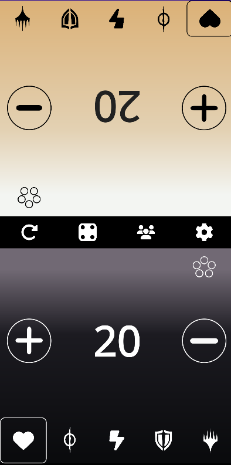
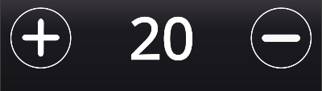
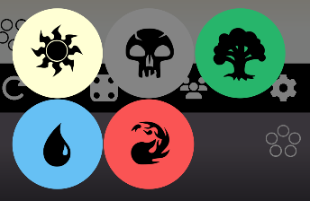
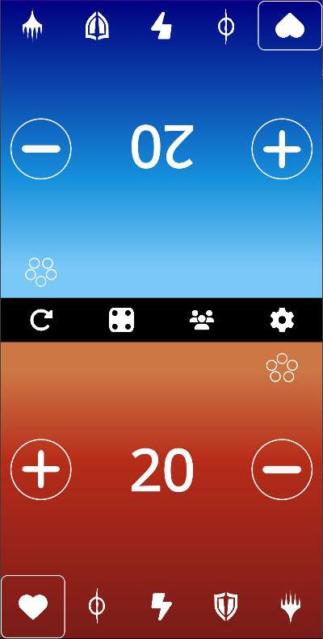
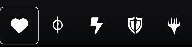
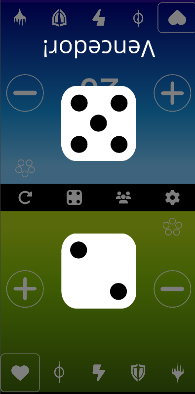
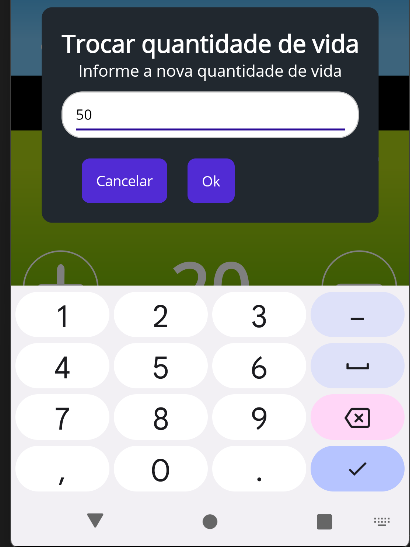
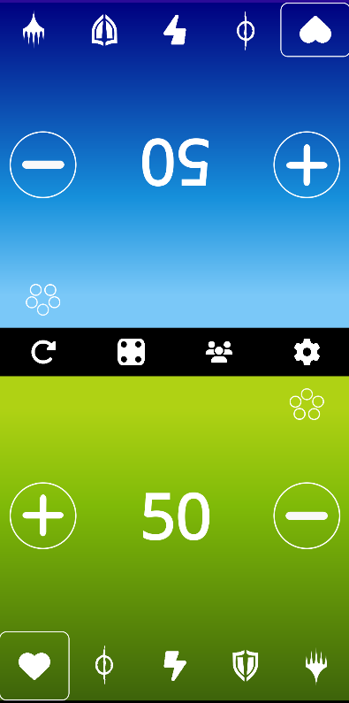

# ContadorVidaMagic.Solution

Este projeto tem como objetivo fornecer um contador de vida para MTG (Magic: The Gathering).

Para utilizá-lo, siga os passos abaixo.

## Instalação do Projeto no seu Celular

### 1. Requisitos:

Antes de começar, certifique-se de que você tenha o seguinte instalado e configurado em seu computador:

- Visual Studio 2022 com as cargas de trabalho para .NET MAUI.
- SDK do .NET 6 ou superior.
- Ferramentas Android para emulação ou um dispositivo físico com a depuração USB ativada.

### 2. Clonar o repositório para seu computador:

Siga os passos abaixo para clonar o repositório do projeto para o seu computador:

1. **Abrir o Git Bash ou Terminal:**  
   Abra o Git Bash no Windows ou o Terminal no macOS/Linux.

2. **Navegar até o Diretório de sua Escolha:**  
   Use o comando **`cd`** para mudar para o diretório onde você deseja clonar o repositório. Por exemplo:

    ```bash
    cd /caminho/para/seu/diretorio
    ```

3. **Clonar o Repositório:**  
   Execute o comando git clone seguido da URL do repositório. Por exemplo:

    ```bash
    git clone https://github.com/Evertonmag/ContadorVidaMagic.git
    ```

4. **Abrir o Projeto:**  
   Agora basta abrir o projeto no Visual Studio 2022.

### 3. Compilar o projeto para seu celular:

Após clonar o repositório, siga os passos abaixo para compilar e rodar o projeto em um celular:

1. **Abrir o Visual Studio 2022:**  
   Inicie o Visual Studio 2022.

2. **Abrir o Projeto:**  
   No Visual Studio, clique em File > Open > Project/Solution e navegue até o diretório onde o repositório foi clonado. Selecione o arquivo de solução (.sln) do projeto .NET MAUI.

3. **Configurar o Dispositivo:**
   - **Emulador Android:** Se você estiver usando um emulador Android, certifique-se de que ele esteja configurado e iniciado. No Visual Studio, selecione o emulador na lista de dispositivos.
   - **Dispositivo Físico:** Se você estiver usando um dispositivo físico, conecte-o ao seu computador via USB e ative a depuração USB. Certifique-se de que o dispositivo está reconhecido pelo Visual Studio.

4. **Selecionar a Configuração de Build:**  
   No menu superior do Visual Studio, selecione **`Debug`** ou **`Release`** na lista de configurações de build. Recomendamos Release se for utilizar como um aplicativo normalmente, e Debug se for executar modificações no código.

5. **Selecionar o Projeto de Inicialização:**  
   No Solution Explorer, clique com o botão direito do mouse no projeto .NET MAUI e selecione Set as Startup Project.

6. **Compilar e Rodar o Projeto:**  
   Clique no botão Run (ou pressione F5) para compilar e rodar o projeto no dispositivo selecionado. O Visual Studio compilará o projeto e implantará o aplicativo no emulador ou no dispositivo físico.

### 4. Solução de Problemas Comuns

- **Problemas de Conexão:** Se o dispositivo físico não for reconhecido, verifique se a depuração USB está ativada e se os drivers necessários estão instalados.
- **Erros de Build:** Verifique se todas as dependências do projeto estão instaladas e se o SDK do .NET MAUI está atualizado.
- **Emulador Lento:** Aumente a RAM alocada para o emulador nas configurações do Android Device Manager.

## Como o aplicativo funciona

### Tela inicial:



A tela inicial é dividida ao meio para que você possa jogar com um amigo. Cada parte da tela possui três seções importantes:

1. **Contador com Botões para Aumentar e Diminuir:**

   

2. **Botão para Escolher a Cor Representante do Seu Deck:**

   

   Ao clicar no botão, as opções de cor do deck são exibidas:

   

   Após a seleção, a tela mudará de acordo com a cor escolhida:

   

3. **Seção Inferior com Divisões para Mudar o Tipo de Contador:**

   

   Esta seção pode ser usada para contar marcadores de veneno, energia, commander ou Planeswalker.

### Funcionalidades Extras

Na divisão das telas, há algumas funcionalidades adicionais:


**1. A funcionalidade refresh:**


Reinicia o jogo.

**2. A funcionalidade dados:**


Roda dois dados d6, útil para determinar quem jogará primeiro, entre outras utilidades.



Futuramente, nas próximas atualizações, haverá a opção de selecionar qual tipo de dado gostaria de utilizar caso queira rodar algum dado específico.

**3. A funcionalidade configurações:**


Permite modificar a quantidade inicial de vida dos jogadores.




**4. A funcionalidade mais players:**


Esta funcionalidade ainda não foi implementada, mas futuramente permitirá selecionar a quantidade de jogadores (2, 3 ou 4).
